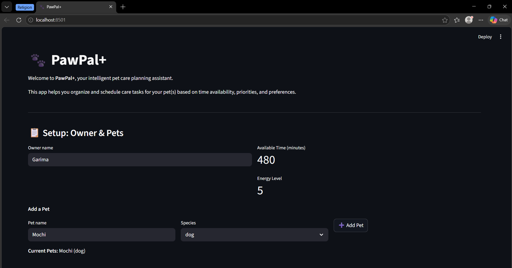
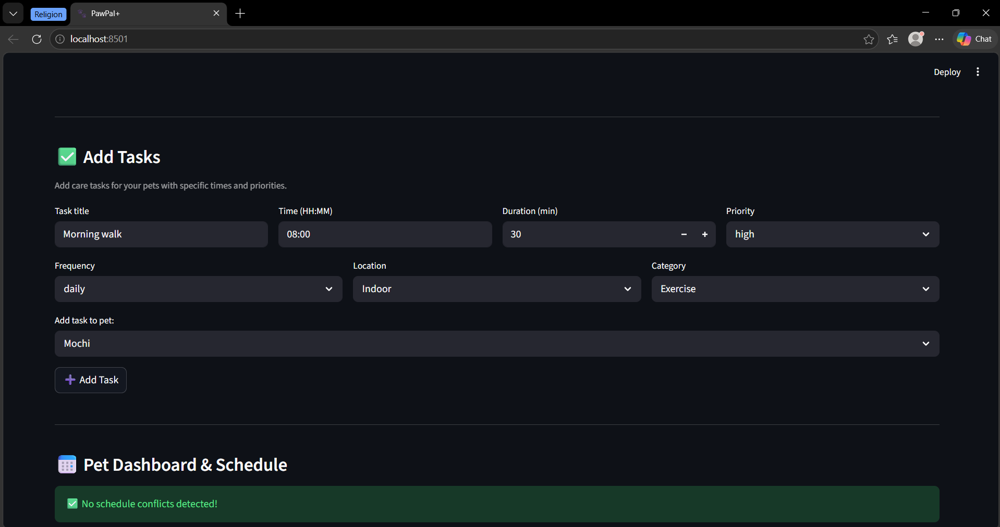
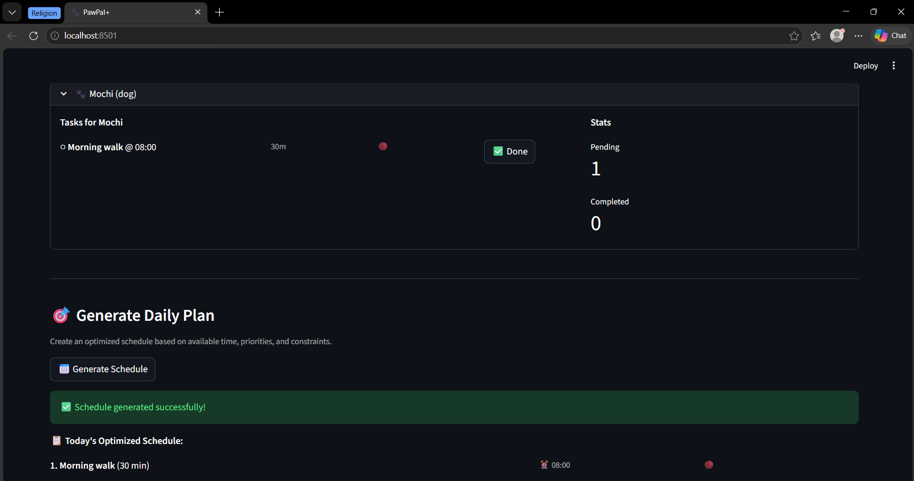
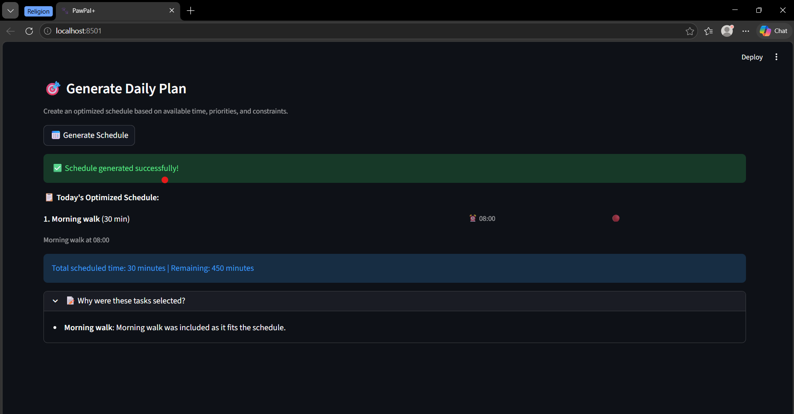

# PawPal+ (Module 2 Project)

You are building **PawPal+**, a Streamlit app that helps a pet owner plan care tasks for their pet.

## Scenario

A busy pet owner needs help staying consistent with pet care. They want an assistant that can:  

- Track pet care tasks (walks, feeding, meds, enrichment, grooming, etc.)
- Consider constraints (time available, priority, owner preferences)
- Produce a daily plan and explain why it chose that plan

Your job is to design the system first (UML), then implement the logic in Python, then connect it to the Streamlit UI.

## What you will build

Your final app should:

- Let a user enter basic owner + pet info
- Let a user add/edit tasks (duration + priority at minimum)
- Generate a daily schedule/plan based on constraints and priorities
- Display the plan clearly (and ideally explain the reasoning)
- Include tests for the most important scheduling behaviors

## Getting started

### Setup

```bash
python -m venv .venv
source .venv/bin/activate  # Windows: .venv\Scripts\activate
pip install -r requirements.txt
```

### Suggested workflow

1. Read the scenario carefully and identify requirements and edge cases.
2. Draft a UML diagram (classes, attributes, methods, relationships).
3. Convert UML into Python class stubs (no logic yet).
4. Implement scheduling logic in small increments.
5. Add tests to verify key behaviors.
6. Connect your logic to the Streamlit UI in `app.py`.
7. Refine UML so it matches what you actually built.

## Smarter Scheduling

The scheduler now includes intelligent algorithmic features to optimize pet care planning:

- Time-Based Sorting: Tasks are sorted chronologically by assigned time slots, enabling organized schedule visualization and execution.
- Flexible Filtering: Filter tasks by completion status or pet name to view focused task subsets for planning and tracking.
- Recurring Task Automation: Daily and weekly recurring tasks automatically generate new instances upon completion, ensuring consistent pet care without manual re-entry.
- Conflict Detection: The scheduler identifies time conflicts between tasks at the same time slot and provides lightweight, actionable warnings to prevent scheduling overlaps.

## Testing PawPal+

Run the test suite using:

```bash
python -m pytest
```

### Test Coverage

- Sorting Correctness: Tasks are ordered in chronological order by their assigned time slots (HH:MM format), handling edge cases like empty lists and identical times.
- Recurrence Logic: Daily and weekly recurring tasks automatically generate new instances with correct status and properties upon completion, including transitions across month boundaries.
- Conflict Detection: The system identifies time overlaps between tasks across multiple pets and generates actionable warnings without false positives.

### System Reliability

Confidence Level: ⭐⭐⭐⭐⭐ (5/5 stars)

All core edge cases for time-based sorting, recurring task transitions (including month-end scenarios), and conflict detection have been verified with passing pytest results. The test suite ensures the scheduler reliably handles empty task lists, simultaneous tasks for different pets, and task recurrence across temporal boundaries.

### Features: 
Sorting by Time — Tasks are ordered chronologically using sort_by_time() on their HH:MM timestamps.
Conflict Warnings — detect_conflicts() scans pending tasks and warns when two or more tasks share the same time slot.
Daily/Weekly Recurrence — complete_task() automatically creates the next occurrence of recurring tasks and preserves task attributes.
Bandwidth-Aware Scheduling — generateDailyPlan() respects owner time/energy limits via OwnerBandwidth.canFitTask().
Viability & Preference Filtering — Tasks are included only if isViable() is true and no pet preferences are violated.
Dependency-Aware Optional Task Selection — Optional tasks are scheduled only after required dependency titles are already included.
Wellness Debt Prioritization — Optional tasks are prioritized by task priority, wellness debt, and duration to optimize the daily plan.

### 📸 Demo:

<a href='pawpal_demo.png' target='_blank'></a>

<a href='pawpal_demo.png' target='_blank'></a>

<a href='pawpal_demo.png' target='_blank'></a>

<a href='pawpal_demo.png' target='_blank'></a>


